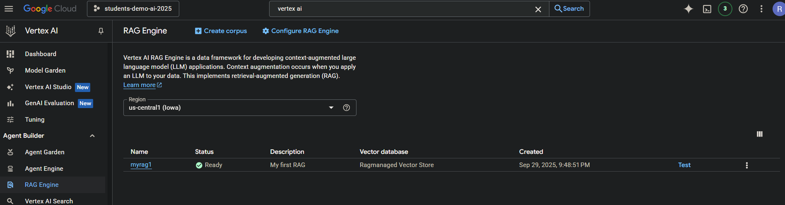
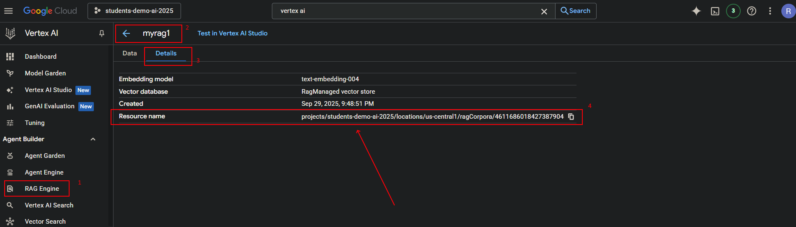

1. Goto Vertex AI service in Google Cloud.
2. Under Agent Builder => RAG Engine, click on "Create a RAG Corpus" button.
3. Give "Corpus Name"
4. Click on "Upload a Local file" and upload goog-10-k-2024.pdf document. 
   (NOTE: Download the pdf from https://abc.xyz/assets/77/51/9841ad5c4fbe85b4440c47a4df8d/goog-10-k-2024.pdf)
5. Click Next
6. Select "Text Embedding 004" as the embedding model.
7. Select "RagManaged vector store" as Vector Database.
8. Click on "Create Corpus". Wait for the corpus to be Ready.

9. Get the corpus ID.

